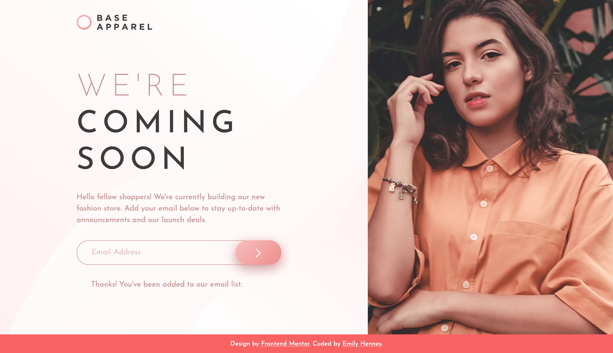

# Frontend Mentor - Base Apparel coming soon page solution

This is a solution to the [Base Apparel coming soon page challenge on Frontend Mentor](https://www.frontendmentor.io/challenges/base-apparel-coming-soon-page-5d46b47f8db8a7063f9331a0). Frontend Mentor challenges help you improve your coding skills by building realistic projects. 

## Table of contents

- [Overview](#overview)
  - [The challenge](#the-challenge)
  - [Screenshot](#screenshot)
  - [Links](#links)
- [My process](#my-process)
  - [Built with](#built-with)
  - [Continued development](#continued-development)
- [Author](#author)

## Overview

### The challenge

Users should be able to:

- View the optimal layout for the site depending on their device's screen size
- See hover states for all interactive elements on the page
- Receive an error message when the `form` is submitted if:
  - The `input` field is empty
  - The email address is not formatted correctly

### Screenshot

### Links

- Solution URL: [https://github.com/ehennes/frontend-mentor-coming-soon](https://github.com/ehennes/frontend-mentor-coming-soon)
- Live Site URL: [https://eh-coming-soon.netlify.app/](https://eh-coming-soon.netlify.app/)

## My process

### Built with

- Semantic HTML5 markup
- CSS custom properties
- CSS nesting
- Flexbox

### Continued development

This is a pretty straightforward splash page with a full length image to the right and minimal content to the left, including a form. Ideally, I will swap out the image and content and put this as a placeholder while I am building out my new personal site. I will also need to add a more robust form set up and validation.

## Author

- Website - [Emily Hennes](https://www.linkedin.com/in/emily-hennes/)
- Frontend Mentor - [@ehennes](https://www.frontendmentor.io/profile/ehennes)

